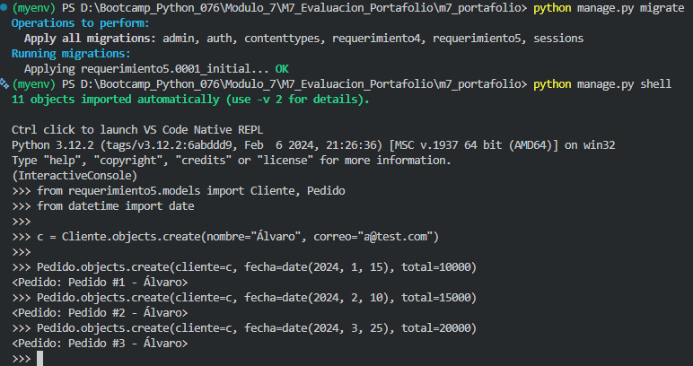
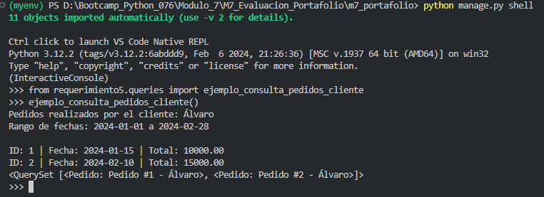

# Requerimiento 5: Consultas Avanzadas en Django ORM (Filtrado y Rangos)

## 📌 Descripción del Requerimiento

Este requerimiento consiste en realizar **consultas de filtrado de datos y consultas personalizadas** utilizando el **ORM de Django** y sentencias SQL para la recuperación de información de la base de datos, dando solución a un problema específico.

Se utilizan métodos avanzados como `filter()`, `exclude()`, `get()`, y `annotate()` para manipular los QuerySets de manera eficiente.

## 🎯 Objetivo

El objetivo es demostrar el dominio en la **recuperación selectiva y compleja de datos** en Django, implementando una consulta que recupere todos los pedidos realizados por un cliente específico dentro de un rango de fechas determinado.

---

## 🛠️ Desarrollo del Ejemplo

El ejemplo de desarrollo se enfoca en el archivo `requerimiento5/queries.py` y opera sobre los modelos `Cliente` y `Pedido` definidos en la aplicación.

### ✔️ Modelos Utilizados

Los modelos de la base de datos son:

```python
from django.db import models

class Cliente(models.Model):
    nombre = models.CharField(max_length=100)
    correo = models.EmailField(unique=True)

    def __str__(self):
        return self.nombre


class Pedido(models.Model):
    cliente = models.ForeignKey(Cliente, on_delete=models.CASCADE)
    fecha = models.DateField()
    total = models.DecimalField(max_digits=10, decimal_places=2)

    def __str__(self):
        return f"Pedido #{self.id} - {self.cliente.nombre}"
```

## ✔️ Consulta de Filtrado Implementada
La función ejemplo_consulta_pedidos_cliente implementa la lógica de filtrado utilizando la combinación de get() y filter() con el look-up __range.

Ubicación: requerimiento5/queries.py

```python
from datetime import date
from requerimiento5.models import Cliente, Pedido


def ejemplo_consulta_pedidos_cliente():
    """
    Consulta todos los pedidos realizados por un cliente específico
    en un rango de fechas determinado utilizando el ORM de Django.
    """
    # Obtener el cliente específico
    cliente = Cliente.objects.get(nombre="Álvaro")

    # Filtrar los pedidos por cliente y por rango de fechas (look-up '__range')
    pedidos = Pedido.objects.filter(
        cliente=cliente,
        fecha__range=(date(2024, 1, 1), date(2024, 2, 28))
    )

    # Imprimir resultados
    print("Pedidos realizados por el cliente:", cliente.nombre)
    print("Rango de fechas: 2024-01-01 a 2024-02-28\n")
    for p in pedidos:
        print(f"ID: {p.id} | Fecha: {p.fecha} | Total: {p.total}")

    return pedidos
```

## 🚀 Uso del ORM
El uso de fecha__range es crucial en este requerimiento, ya que permite generar la cláusula SQL BETWEEN de manera nativa en el ORM de Django, optimizando la consulta.  

### Métodos ORM empleados:  

- Cliente.objects.get(...): Para la recuperación del registro único del cliente.  
- Pedido.objects.filter(...): Para aplicar múltiples condiciones de filtrado simultáneamente.  
- fecha__range: Look-up de campo para filtrar por un rango inclusivo de fechas.

## 📸 Capturas de Pantalla  





## ✅ Conclusión
Este requerimiento cumple con el objetivo de utilizar las capacidades de filtrado avanzado del ORM de Django. Se demostró cómo combinar la recuperación de objetos específicos con el filtrado por múltiples condiciones y rangos, una técnica fundamental para la extracción de información empresarial y la optimización de QuerySets.