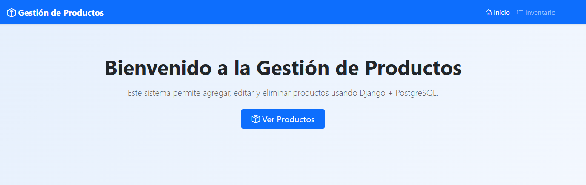
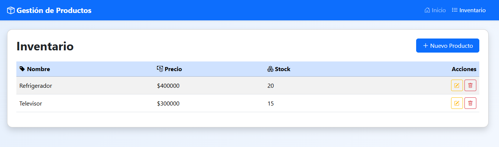
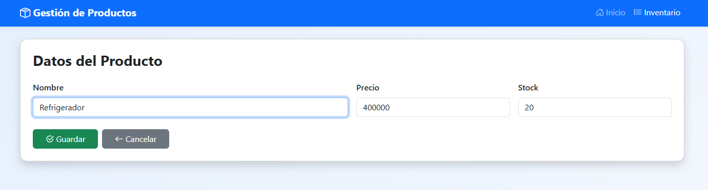
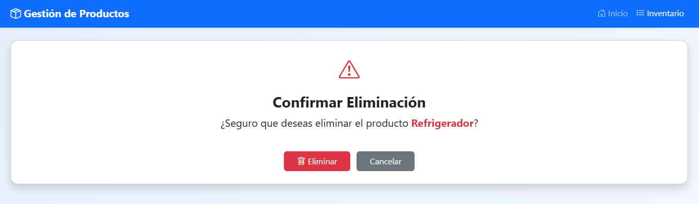
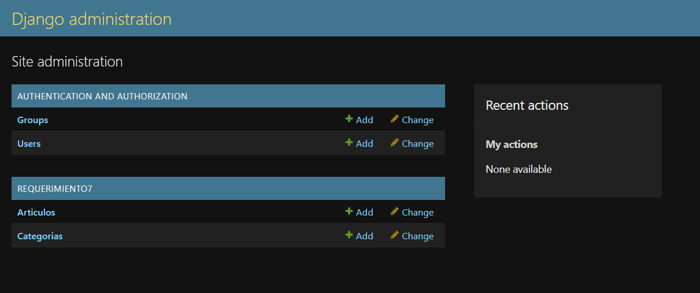
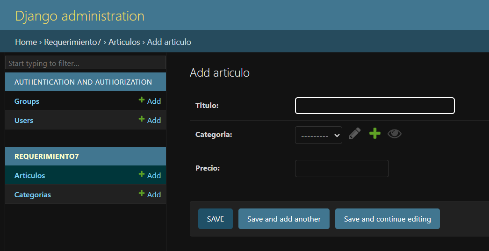

# Requerimiento 6: Implementación de Aplicación MVC con CRUD en Django

## 📌 Descripción del Requerimiento

Este requerimiento consiste en la implementación de una aplicación web siguiendo el patrón **Modelo-Vista-Controlador (MVC)**, utilizando los componentes del *framework* **Django** para realizar las operaciones fundamentales **CRUD** (Crear, Leer, Actualizar y Eliminar) sobre una base de datos.

La aplicación desarrollada es un sistema simple de **Gestión de Productos**.

## 🎯 Objetivo

Crear una aplicación Django funcional que demuestre la correcta integración de:
1.  **Modelos (M):** Definición de la estructura de la base de datos.
2.  **Vistas (V):** Lógica de negocio y manejo de la solicitud/respuesta HTTP.
3.  **URLs (C/Controlador):** Enrutamiento de peticiones a las vistas adecuadas.
4.  **Formularios de Django:** Manejo seguro de la entrada y validación de datos.

---

## 🛠️ Desarrollo de la Aplicación (Gestión de Productos)

### ✔️ Modelo Principal

Se define el modelo `Producto` para representar los datos que se gestionarán en la base de datos.

```python
from django.db import models

class Producto(models.Model):
    nombre = models.CharField(max_length=100)
    precio = models.DecimalField(max_digits=10, decimal_places=0)
    stock = models.IntegerField()

    def __str__(self):
        return self.nombre
```

### ✔️ Formularios (`forms.py`)

Se utiliza un **ModelForm** para simplificar la creación de formularios y la interacción directa con el modelo `Producto`, incluyendo la validación y el guardado de datos.

```python
from django import forms
from .models import Producto

class ProductoForm(forms.ModelForm):
    class Meta:
        model = Producto
        fields = ["nombre", "precio", "stock"]
        widgets = {
            "nombre": forms.TextInput(attrs={"class": "form-control"}),
            "precio": forms.NumberInput(attrs={"class": "form-control"}),
            "stock": forms.NumberInput(attrs={"class": "form-control"}),
        }
```
---

## 🗺️ Enrutamiento y Funcionalidades CRUD

El archivo **`urls.py`** define las rutas para cada una de las operaciones CRUD, incluyendo el uso de **parámetros dinámicos (`<int:pk>`)** para identificar registros específicos en las acciones de edición y eliminación.

### Rutas (`urls.py`)

```python
from django.urls import path
from . import views

urlpatterns = [
    path("", views.home, name="home"),
    path("productos/", views.producto_list, name="producto_list"),
    path("productos/nuevo/", views.producto_create, name="producto_create"),
    path("productos/<int:pk>/editar/", views.producto_update, name="producto_update"),
    path("productos/<int:pk>/eliminar/", views.producto_delete, name="producto_delete"),
]
```
---

## Funcionalidad de Vistas (`views.py`)

Las vistas implementan la lógica del CRUD mediante funciones que manejan las peticiones HTTP y la interacción con el modelo:

| Operación | Vista | Método HTTP | URL Name | Descripción |
| :--- | :--- | :--- | :--- | :--- |
| **READ** (Lista) | `producto_list` | GET | `producto_list` | Recupera todos los productos (`Producto.objects.all()`) y los muestra. |
| **CREATE** | `producto_create` | GET/POST | `producto_create` | Muestra el formulario (`GET`) y procesa el guardado del nuevo producto (`POST`). |
| **UPDATE** | `producto_update` | GET/POST | `producto_update` | Recupera un producto específico (`get_object_or_404`), lo precarga en el formulario y guarda los cambios. |
| **DELETE** | `producto_delete` | GET/POST | `producto_delete` | Muestra la confirmación (`GET`) y elimina el registro (`POST`). |

---

## 🚀 Instalación y Pruebas

Sigue estos pasos para configurar y ejecutar el proyecto localmente.

### Clonar el Repositorio

    git clone [https://www.youtube.com/watch?v=_jABgj6BHCo](https://www.youtube.com/watch?v=_jABgj6BHCo)
    cd requerimiento6

### Crear y Activar Entorno Virtual

Se recomienda usar un entorno virtual para aislar las dependencias:
  ```bash
    # Crear entorno virtual
    python3 -m venv venv

    # Activar entorno (Linux/macOS)
    source venv/bin/activate

    # Activar entorno (Windows)
    .\venv\Scripts\activate
```

### Instalar Dependencias

Instala el framework **Django**:
```bash
    pip install django
```

### Aplicar Migraciones

Crea las tablas de los modelos en la base de datos:

```bash
    python manage.py makemigrations
    python manage.py migrate
```

### Ejecutar el Servidor
```bash
    python manage.py runserver
```

La aplicación estará disponible para su uso en la ruta configurada [http://127.0.0.1:8000/](http://127.0.0.1:8000/).

## 📸 Capturas de Pantalla









## ✅ Conclusión

Este requerimiento valida la comprensión e implementación del patrón **MVC de Django** para construir una aplicación transaccional completa. Se demostró la capacidad de interconectar modelos, formularios, vistas y enrutamiento para gestionar el ciclo de vida completo (**CRUD**) de la entidad Producto.